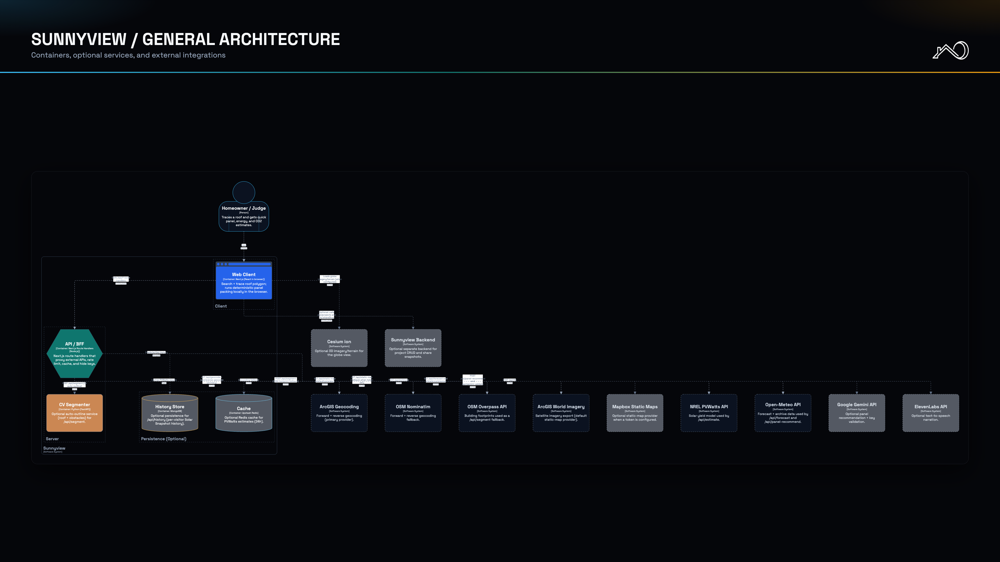
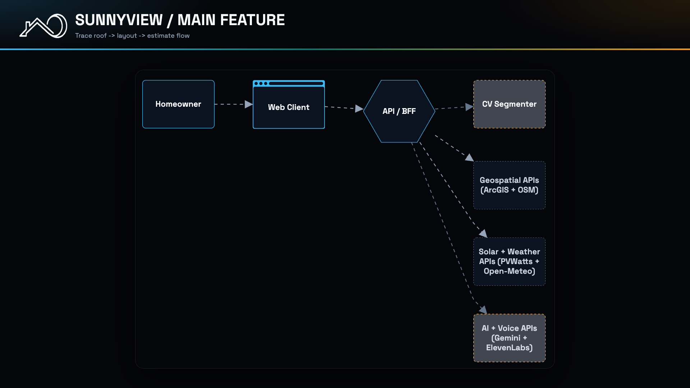

# Sunnyview

🏆 **Winner: Best Use of Gemini API at SF Hacks 2026** 🏆

[](https://sunnyview-sf-hacks.vercel.app)
[](https://nextjs.org/)
[](https://www.typescriptlang.org/)

Fast rooftop solar feasibility demo from SF Hacks 2026.

## Live Demo

- Site: https://sunnyview-sf-hacks.vercel.app

## Team

- [Md Safkatul Islam](https://www.linkedin.com/in/md-safkatul-islam/)
- [Sean Esla](https://www.linkedin.com/in/seanesla/)
- [Kai Shimoda](https://www.linkedin.com/in/kai-shimoda/)
- [Aleks Ershov](https://www.linkedin.com/in/aleksershov)

## Architecture Diagrams

General architecture:



Main feature flow:



## What This Repo Contains

- Next.js app (App Router)
- Deterministic panel-packing logic
- Local API routes:
  - `/api/geocode`
  - `/api/static-map`
  - `/api/reverse-geocode`
  - `/api/estimate`
  - `/api/segment`
  - `/api/explain`
  - `/api/tts`
  - `/api/forecast`
  - `/api/panel-recommend`
  - `/api/gemini-validate`

## External Dependencies

These are optional and require a separate backend service:

- `POST /api/projects`
- `GET /api/projects/:id`
- `PATCH /api/projects/:id`
- `GET /s/:shareSlug`

## Quick Start

Requirements: Node.js 20+ and npm.

```bash
npm install
cp .env.local.example .env.local
npm run dev
```

Open `http://localhost:3000`.

## Scripts

- `npm run dev` - start dev server
- `npm run build` - production build
- `npm run start` - start production server
- `npm run lint` - lint codebase

## Notes

- Estimates are directional, not permit-ready engineering output.
